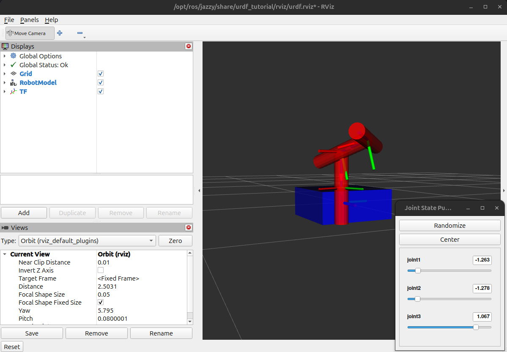

# Reto Multipacha

## Descripción
Este repositorio es para documentar avances, problemas y resolución de estos para completar el Reto Multipacha.

## Desarrollo para ROS
### Creación del *workspace*
Se crea una carpeta **reto** para almacenar el *workspace*.
```bash
mkdir reto
```
Y dentro se crea el workspace **multipacha_ws** además se crea la carpeta **src** que se usará para almacenar el paquete pedido.
```bash
mkdir multipacha_ws
mkdir src
```
Se construye el workspace usando `colcon build`
y con `ls` se pueden ver los archivos generados.
```
build  install  log  src
``` 
Para crear el paquete **reto_m6** se ingresa a la carpeta **src** creada anteriormente.
```bash
cd src/
```
Una vez dentro se crea el paquete.
```
ros2 pkg create reto_m6 --build-type ament_python --dependencies rclpy rviz2
```
Si bien se pide usar las dependencias **rviz** y **rospy**  las cuales son de *ROS*, pero en este caso se está usando *ROS 2*.

Finalmente se ingresa al paquete creado mediante
```bash
cd reto_m6/
```
Y se crean los directorios **launch** y **urdf**
```bash
mkdir launch
mkdir urdf
```
### Creación y comunicación entre *nodes* mediante *topics*
Luego de generar el *workspace*, y de crear el paquete en *Python* **reto_m6**, se crea un archivo **.py** en la dirección **reto_m6/reto_m6/** llamado *reto_topic_pub*.
  ```bash
touch reto_topic_pub.py
```
En el que se escribe el siguiente código *(Los comentarios fueron generados por Copilot)*.
```python
#!usr/bin/env python3
# Línea shebang que indica al sistema operativo que este script debe ejecutarse con Python 3.

import rclpy
# Importa el paquete principal de ROS 2 para Python, que permite interactuar con el sistema ROS 2.

from rclpy.node import Node
# Importa la clase base `Node` de ROS 2, que se utiliza para crear nodos.

from std_msgs.msg import String
# Importa el tipo de mensaje estándar `String` de ROS 2, que se usará para publicar mensajes de texto.

class MessagePublisherNode(Node):
    # Define una clase que hereda de `Node` y representa un nodo de publicación de mensajes.

    def __init__(self):
        # Constructor de la clase.
        super().__init__('message_publisher')
        # Llama al constructor de la clase base `Node` y le asigna el nombre 'message_publisher'.

        self.publisher_ = self.create_publisher(String, 'message_publisher', 10)
        # Crea un publicador que enviará mensajes del tipo `String` al tópico 'message_publisher'.
        # El tercer argumento (10) es el tamaño de la cola del publicador.

        self.timer_ = self.create_timer(0.1, self.publish_message)
        # Crea un temporizador que ejecutará el método `publish_message` cada 0.1 segundos.

        self.get_logger().info('Message Publisher Node has been started.')
        # Escribe un mensaje en el registro indicando que el nodo ha sido iniciado.

    def publish_message(self):
        # Método que publica un mensaje en el tópico.
        msg = String()
        # Crea una instancia del mensaje `String`.

        msg.data = 'M6 Reto'
        # Asigna el texto 'M6 Reto' al campo `data` del mensaje.

        self.publisher_.publish(msg)
        # Publica el mensaje en el tópico asociado al publicador.

def main(args=None):
    # Función principal del script.
    rclpy.init(args=args)
    # Inicializa el cliente de ROS 2.

    node = MessagePublisherNode()
    # Crea una instancia del nodo `MessagePublisherNode`.

    rclpy.spin(node)
    # Mantiene el nodo en ejecución para que pueda procesar eventos (como el temporizador).

    rclpy.shutdown()
    # Finaliza el cliente de ROS 2 cuando el nodo deja de ejecutarse.

if __name__ == '__main__':
    main()
    # Punto de entrada del script. Llama a la función `main` si el script se ejecuta directamente.
```
Este nodo que hará de *publisher* estará enviando el *String* **"Reto M6"**. Adicionalmente agregamos la dependencia **std_msgs.msg** a **package.xml**
```xml
 <depend>std_msgs.msg</depend>
```
Y el ejecutable a **setup.py**
```python
'reto_topic_pub = reto_m6.reto_topic_pub:main'
```
De igual manera se crea un archivo **.py** la misma carpeta con el nombre de *reto_topic_sub* que será el nodo suscriptor.
  ```bash
touch reto_topic_pub.py
```
Y se escribe el siguiente código *(Los comentarios fueron generados por Copilot)*.
```python
#!/usr/bin/env python3
# Shebang line indicating that the script should be executed using Python 3.

import rclpy
# Import the ROS 2 Python client library, which provides tools for creating nodes and interacting with the ROS 2 system.

from rclpy.node import Node
# Import the base class `Node` from the ROS 2 library, which is used to create custom nodes.

from std_msgs.msg import String
# Import the `String` message type from the standard ROS 2 message library.

class MessageSubscriberNode(Node):
    # Define a custom ROS 2 node class named `MessageSubscriberNode` that inherits from `Node`.

    def __init__(self):
        # Constructor method for initializing the node.
        super().__init__("message_subscriber")
        # Call the parent class constructor and set the node name to "message_subscriber".
        
        self.subscriber_ = self.create_subscription(
            String, "message_publisher", self.callback_message, 10)
        # Create a subscription to the "message_publisher" topic, expecting messages of type `String`.
        # The `callback_message` method will be called whenever a message is received.
        # The queue size is set to 10.

        self.get_logger().info("Message Subscriber Node has been started.")
        # Log an informational message indicating that the node has started.

    def callback_message(self, msg: String):
        # Define the callback function that will be executed when a message is received.
        self.get_logger().info(msg.data)
        # Log the content of the received message.

def main(args=None):
    # Define the main function, which serves as the entry point for the script.
    rclpy.init(args=args)
    # Initialize the ROS 2 Python client library.

    node = MessageSubscriberNode()
    # Create an instance of the `MessageSubscriberNode`.

    rclpy.spin(node)
    # Keep the node running and listening for messages until it is shut down.

    rclpy.shutdown()
    # Shut down the ROS 2 Python client library when the node stops.

if __name__ == "__main__":
    main()
    # If the script is executed directly, call the `main` function.
```
Se construye el proyecto en el *workspace* usando 
```bash
colcon build --packages-select reto_m6
```
Se fuentea en el directorio */home* usando `source .bashrc` y se corre el paquete **reto_m6** con el nodo publicador.
```bash
ros2 run reto_m6 reto_topic_pub
```
Y se obtiene en la consola:
```bash
[INFO] [1743258493.390171920] [message_publisher]: Message Publisher Node has been started.
```
Confirmando que el nodo ha sido iniciado con el tópico */message_publisher*. Análogamente se inicia el nodo suscriptor usando:
```bash
ros2 run reto_m6 reto_topic_sub
```
```bash
[INFO] [1743258654.233694919] [message_subscriber]: Message Subscriber Node has been started.
```


### Creación y vizualicaión de archivo URDF
En la carpeta **/urdf** que se creo anteriormente se escribe un archivo **reto_robot.urdf**.
```bash
cd urdf/
touch reto_robot.urdf
code reto_robot.urdf
```
En este caso se piden como mínimo tres *links* y una juntura *continous* o *revolute*, lo que se presentará será una base con tres eslabones todos unidos mediante una juntura de revolución solo que los ultimos dos tendran ejes de giro diferentes.*(Los comentarios fueron generados por Copilot)*.
```xml
<?xml version="1.0"?>
<!-- Declaración XML indicando la versión utilizada. -->

<robot name="reto_robot">
<!-- Define el inicio del modelo del robot con el nombre "reto_robot". -->

    <!-- Base -->
    <link name="base_link">
        <!-- Define un enlace llamado "base_link" que representa la base del robot. -->
        <visual>
            <!-- Sección visual del enlace, define cómo se verá el enlace. -->
            <geometry>
                <!-- Define la geometría del enlace. -->
                <box size="0.5 0.5 0.2"/>
                <!-- Especifica que la geometría es una caja con dimensiones 0.5x0.5x0.2. -->
            </geometry>
            <material name="blue">
                <!-- Define el material del enlace con el nombre "blue". -->
                <color rgba="0 0 1 1"/>
                <!-- Especifica el color azul con opacidad completa (RGBA: 0, 0, 1, 1). -->
            </material>
        </visual>
    </link>
    
    <!-- Eslabón 0-->
    <link name="arm_link_0">
        <!-- Define un enlace llamado "arm_link_0", que representa el primer eslabón del brazo. -->
        <visual>
            <!-- Sección visual del enlace. -->
            <geometry>
                <!-- Define la geometría del enlace. -->
                <cylinder radius="0.05" length="0.5"/>
                <!-- Especifica que la geometría es un cilindro con radio 0.05 y longitud 0.5. -->
            </geometry>
            <material name="red">
                <!-- Define el material del enlace con el nombre "red". -->
                <color rgba="1 0 0 1"/>
                <!-- Especifica el color rojo con opacidad completa (RGBA: 1, 0, 0, 1). -->
            </material>
        </visual>
    </link>
    
    <!-- Eslabón 1-->
    <link name="arm_link_1">
        <!-- Define un enlace llamado "arm_link_1", que representa el segundo eslabón del brazo. -->
        <visual>
            <geometry>
                <cylinder radius="0.05" length="0.5"/>
                <!-- Geometría similar al eslabón anterior: cilindro con radio 0.05 y longitud 0.5. -->
            </geometry>
            <material name="red">
                <color rgba="1 0 0 1"/>
                <!-- Mismo material y color que el eslabón anterior. -->
            </material>
        </visual>
    </link>

    <!-- Eslabón 2 -->
    <link name="arm_link_2">
        <!-- Define un enlace llamado "arm_link_2", que representa el tercer eslabón del brazo. -->
        <visual>
            <geometry>
                <cylinder radius="0.05" length="0.5"/>
                <!-- Geometría similar a los eslabones anteriores. -->
            </geometry>
            <material name="red">
                <color rgba="1 0 0 1"/>
                <!-- Mismo material y color que los eslabones anteriores. -->
            </material>
        </visual>
    </link>

    <!-- Junta de Revolución 1-->
    <joint name="joint1" type="revolute">
        <!-- Define una junta de tipo "revolute" (revolución) llamada "joint1". -->
        <parent link="base_link"/>
        <!-- Especifica que el enlace padre de esta junta es "base_link". -->
        <child link="arm_link_0"/>
        <!-- Especifica que el enlace hijo de esta junta es "arm_link_0". -->
        <origin xyz="0 0 0.1" rpy="0 0 0"/>
        <!-- Define la posición (xyz) y orientación (rpy) de la junta respecto al enlace padre. -->
        <axis xyz="0 0 1"/>
        <!-- Define el eje de rotación de la junta (en este caso, el eje Z). -->
        <limit effort="10.0" lower="-1.57" upper="1.57" velocity="1.0"/>
        <!-- Establece los límites de la junta: esfuerzo máximo, ángulos mínimo y máximo, y velocidad máxima. -->
    </joint>
    
    <!-- Junta de Revolución 2-->
    <joint name="joint2" type="revolute">
        <!-- Define una junta de tipo "revolute" llamada "joint2". -->
        <parent link="arm_link_0"/>
        <!-- El enlace padre es "arm_link_0". -->
        <child link="arm_link_1"/>
        <!-- El enlace hijo es "arm_link_1". -->
        <origin xyz="0 0 0.25" rpy="0 0 0"/>
        <!-- Define la posición y orientación de la junta respecto al enlace padre. -->
        <axis xyz="1 0 0"/>
        <!-- Define el eje de rotación de la junta (en este caso, el eje X). -->
        <limit effort="10.0" lower="-1.57" upper="1.57" velocity="1.0"/>
        <!-- Establece los límites de la junta. -->
    </joint>
    
    <!-- Junta de Revolución 3 -->
    <joint name="joint3" type="revolute">
        <!-- Define una junta de tipo "revolute" llamada "joint3". -->
        <parent link="arm_link_1"/>
        <!-- El enlace padre es "arm_link_1". -->
        <child link="arm_link_2"/>
        <!-- El enlace hijo es "arm_link_2". -->
        <origin xyz="0 0 0.25" rpy="0 0 0"/>
        <!-- Define la posición y orientación de la junta respecto al enlace padre. -->
        <axis xyz="0 1 0"/>
        <!-- Define el eje de rotación de la junta (en este caso, el eje Y). -->
        <limit effort="10.0" lower="-1.57" upper="1.57" velocity="1.0"/>
        <!-- Establece los límites de la junta. -->
    </joint>
</robot>
<!-- Cierra la definición del robot. -->
```
Luego verificamos si el archivo es correcto.
```bash
check_urdf ~/reto/multipacha_ws/urdf/reto_robot.urdf
```
A lo que obtenemos:
```bash
robot name is: reto_robot
---------- Successfully Parsed XML ---------------
root Link: base_link has 1 child(ren)
    child(1):  arm_link_0
        child(1):  arm_link_1
            child(1):  arm_link_2
```
Finalmente para la visualización del modelo en 3D se hará uso de Rviz, se usará un archivo *launch* predeterminado, pero más adelante se creará uno propio.
```bash
 ros2 launch urdf_tutorial display.launch.py model:=$HOME/reto/multipacha_ws/urdf/reto_robot.urdf
 ```
 


